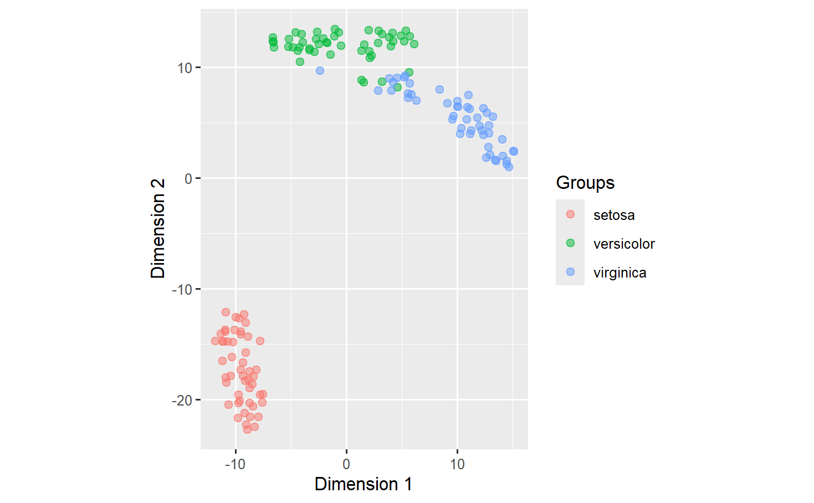
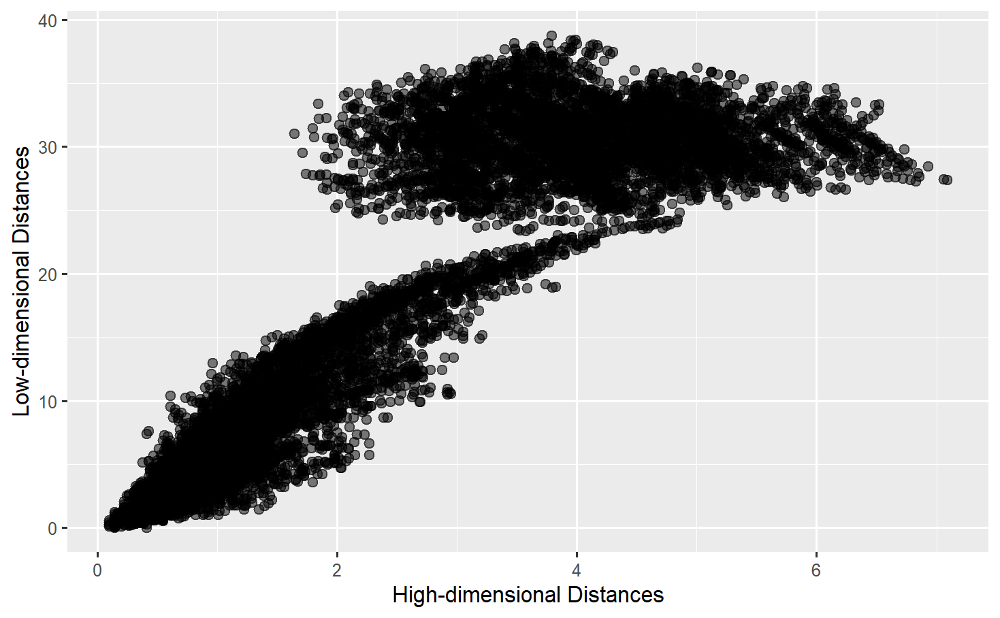
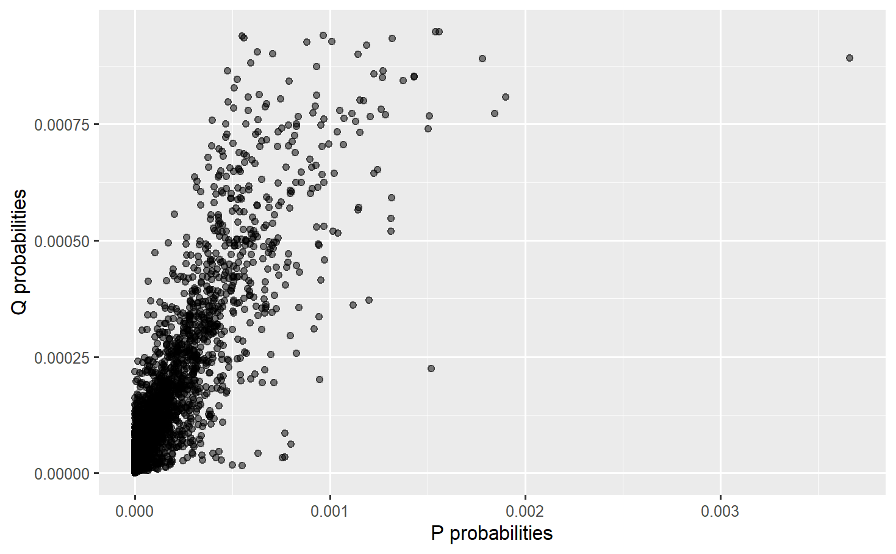
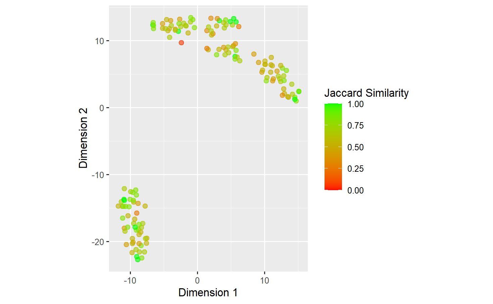
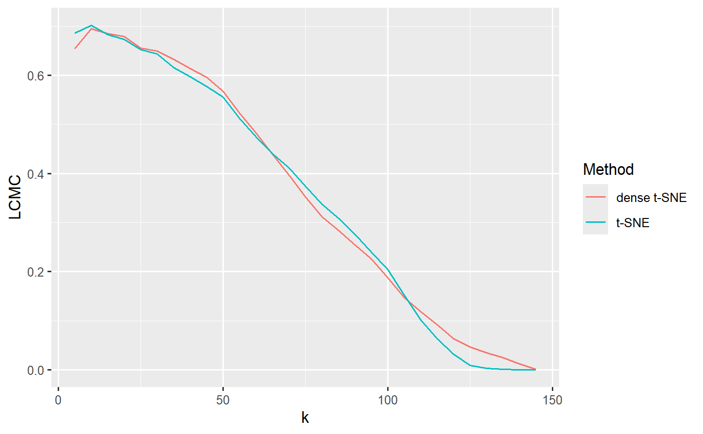

# nldimr

R package wrapper of [Rtsne](https://github.com/jkrijthe/Rtsne), 
[uwot](https://github.com/jlmelville/uwot), 
and [denvis](https://github.com/hhcho/densvis).
Two dimensionality reduction methods: t-SNE and UMAP, and their corresponding 
density-preserving variants were implemented.

The package also includes the following quality measurements:
- The average neighborhood Jaccard similarity
- The Trustworthiness
- The Continuity
- The Local Continuity Meta Criterion (LCMC)

The visual assessment methods implemented in the package:
- The 2D/3D embedding visualization
- The neighborhood Jaccard similarity on 2D embedding result
- The fit plot
- The PW/VW plot


## Installation

To install the latest version from the GitHub repository, use:

```R
if(!require(devtools)) install.packages("devtools") # If not already installed
devtools::install_github("DatPhamABC/nldimr")
```

## Example

```R
library(nldimr)

# Create a t-SNE object
iris_tsne <- R_tsne$new(data = iris[!duplicated(iris),1:4],
                        group = iris[!duplicated(iris),]$Species,
                        dims = 2, perplexity = 20)

# 2D embedding result
iris_tsne$plot_result()
```


```R
# fit plot
iris_tsne$fit_plot()
```


```R
# PW plot
iris_tsne$plot_PQ()
```



```R
# Neighborhood Jaccard similarity for a specific neighborhood size (k=25)
iris_tsne$plot_Jaccard_similarity(k=10)
```



```R
# Create anothe object for comparison (density-preserving t-SNE)
iris_densne <- dense_tsne$new(data = iris[!duplicated(iris),1:4],
                              group = iris[!duplicated(iris),]$Species,
                              dims = 2,
                              perplexity = 20,
                              dens_lambda = 0.3)
                              
# Calculate the LCMC of two object: iris_tsne, iris_densne
# Similarly, the Trustworthiness, Continuity, 
# and average neighborhood Jaccard similarity can be performed with 
# their corresonding function
iris_lcmc <- compare_lcmc(
  c(iris_tsne, iris_densne),
  list_k = seq(5, 200, by = 20),
  group_attrs = c('Params', 'k'),
  verbose = TRUE)
  
ggplot(data = iris_lcmc$summary,
       aes(x = k, y = lcmc, color=Params)) +
  geom_line(linewidth = 0.5) +
  labs(x = 'k', y = 'LCMC', color = 'Method')
```




